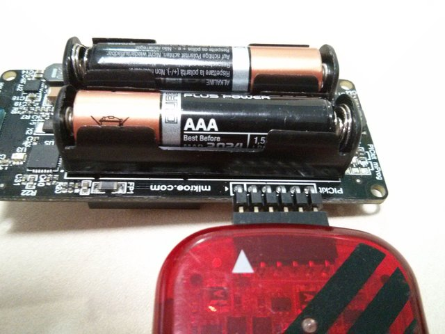
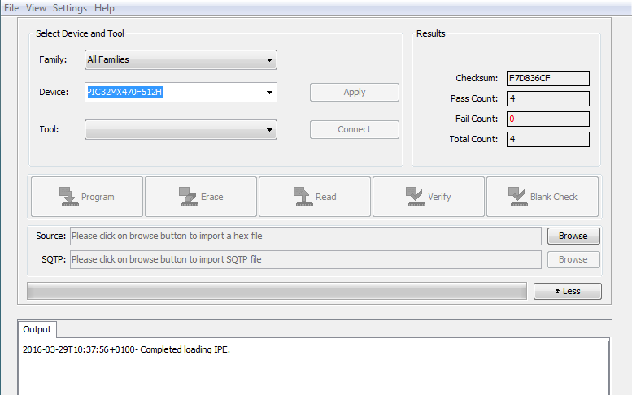
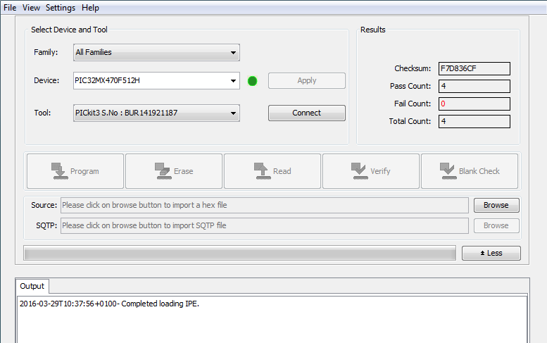
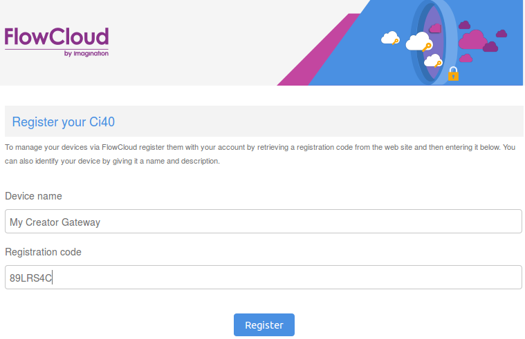
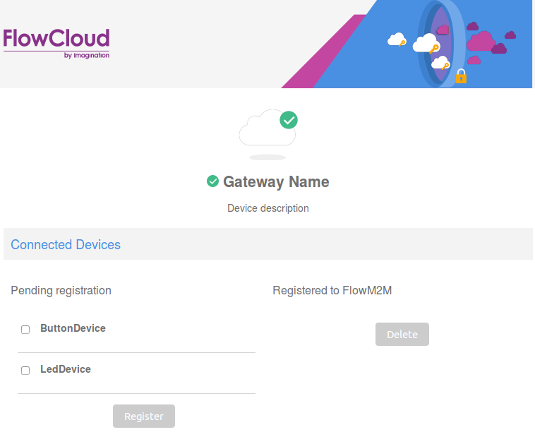
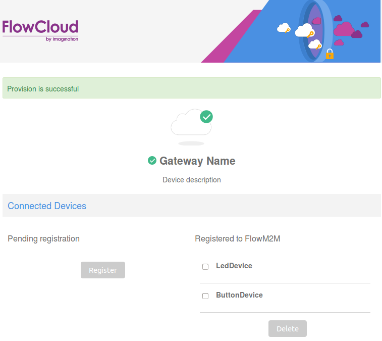

----

Here are the detailed steps that describes how to get CreatorKit up and running.

## Hardware
* Creator Kit
* Ubuntu 14.04 64-bit PC/Laptop

## Powering Ci40 + Clicker boards
There are 2 ways to power your Ci40 board.
* Using a power supply
* Using a microUSB cable connected to the port next to the power supply port

There are also 2 ways to power Clicker boards
* 2 AAA Batteries
* MicroUSB

## Getting the code
You can get pre-built releases or source code of the Creator Kit projects to work with. The Releases will allow you to set up a working system quickly without having to build any code. The source code will allow you to inspect/extend the projects and build the releases yourself.

[Releases](https://github.com/CreatorKit/manifest/releases)

[Source Code](https://github.com/CreatorKit/manifest)

See [Creator-Kit Top level Build system](https://github.com/CreatorKit/build) for information on how to use the source code.

#### Installing dependencies
Initially you need to install dependencies required to build. Run the following in the terminal on your Ubuntu build machine

<code>$ sudo apt-get -y install g++ gcc binutils bzip2 flex python perl make libncurses5-dev libncursesw5-dev libssl-dev grep unzip gawk subversion zlib1g-dev build-essential git mercurial cmake python-nose python-lxml</code>

#### Installing Contiki compiler
In order to build Contiki code for Clicker boards you will need the XC32 compiler from Microchip. For 64-bit Ubuntu, 32-bit runtime libraries must be installed before the XC32 compiler can be run:

<code>$ sudo apt-get install libc6:i386</code>

Follow the official Linux installation instructions [here](http://microchip.wikidot.com/xc32:installation) to install the latest version.

## Running Ci40 board
Connect to Ci40 using serial console by following steps [here](https://github.com/IMGCreator/openwrt#serial-console).

Different methods are available to boot Ci40 board
* [Boot from USB](https://github.com/IMGCreator/openwrt#boot-from-usb)
* [Boot from SD Card](https://github.com/IMGCreator/openwrt#boot-from-sd-card)
* [TFTP Boot](https://github.com/IMGCreator/openwrt#tftp-boot)
* [Boot from Flash](https://github.com/IMGCreator/openwrt#tftp-boot)
* [System upgrade](https://github.com/IMGCreator/openwrt#system-upgrade)

## Connecting Ci40 to the Internet
Ci40 supports Ethernet for network connectivity.

## Programming a 6LoWPAN Clicker
Before programming a Clicker board you need to apply power. You can use batteries, USB or (purely for programming purposes) a Pickit3 programmer.

The first step is to connect a Pickit3.

Make sure that the arrow indicating Pin1 on the back of the board is matched with the arrow on the Pickit3. Once this is done you need to run the MPLAB X IPE, available [here](http://microchip.wikidot.com/ipe:installation), and choose PIC32MX470F512H as the target device.

The Tool field will populate when your Pickit3 has been detected.

Click on the Browse button next to the Source field and select the desired .hex file.

Click Connect next to the Tool field to connect your Pickit3 to your Clicker board. You Clicker board will need to be powered on for this to work. Use USB, Battery or the optional 'power by Pickit3' method described at the end of this section.

Once connected, you can click Program to flash the board. It should only take a few seconds to complete.

OPTIONAL: If you want to, you can use the Pickit3 to power your board while you program. To do this, you need to configure MPLAB X IPE to enable the feature. Click "Settings" > "Advanced Mode". Click on the "Power" category on the left and click the checkbox for "Power Target Circuit from Tool". You can then go back to the "Operate" section and proceed.

## Creating a FlowM2M account

In order to use your Creator Kit you will need to create a free account on [the FlowM2M website](http://beta.flowm2m.io). This account allows you to manage your connected devices, and also interact with them remotely. You will use a device registration code from this site to provision devices using FlowM2M.

## Provisioning Ci40

Log in to your account on [the FlowM2M website](http://beta.flowm2m.io) and view the Dashboard. From here you can navigate to the Devices page. This page will show all previously provisioned devices. In order to add a new device you need to click on the "Register" button, and then take a code.

On your Ci40 you need to connect to a network via Ethernet to gain Internet access, and also access to the onboard web interface. Once connected to a network, you can type the following into the Ci40 terminal

<code># ifconfig</code>

The output of this command will include an eth0 "inet addr" which is the devices IP address.

Using a different device connected to the same network you can now navigate to the Ci40 web interface by opening a browser and typing the IPaddress you got from the ifconfig command into the URL bar.

You will be presented with a page that allows you to name the device, and also add the provisioning code you retrieved from the FlowM2M website.

Once you have provisioned you will be presented with a page allowing you to provision Clicker boards.

## Provisioning Clicker

Once your Ci40 is provisioned you can continue using the web interface to also provision Clicker boards if they have been programmed with FlowM2M enabled software.

You will be presented with a list of 6LoWPAN devices that are within range of the Ci40.

If your Clickers are powered on, they should be displayed on this page. You can now provision these devices using FlowM2M by selecting the checkbox next to the device(s) and clicking the 'Register' button. Once the devices are provisioned they should appear on the right side on the page (this may require a refresh).

