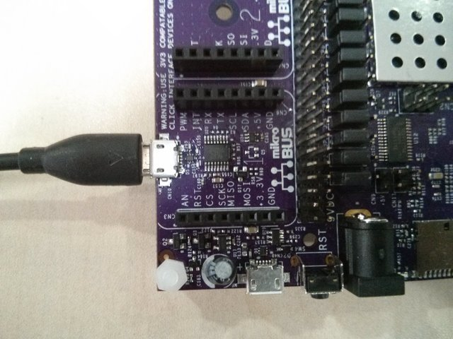
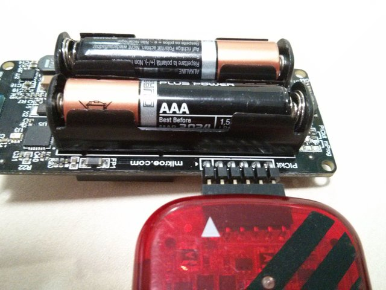

# Toolbox

The toolbox is a reference page for you to use to set up your kit. Follow the steps listed in the project pages and refer back to this page for more detail on individual steps.

## Hardware

* Creator Kit
* Ubuntu 14.04 64-bit PC/Laptop

## Powering Ci40 + Clicker boards

There are 2 ways to power your Ci40 board.

* Using a power supply
* Using a microUSB cable connected to the port next to the power supply port

There are also 2 ways to power Clicker boards

* 2 AAA Batteries
* MicroUSB

## Getting the code

You can get pre-built releases or source code of the Creator Kit projects to work with. The Releases will allow you to set up a working system quickly without having to build any code. The source code will allow you to inspect/extend the projects and build the releases yourself.

[Releases](http://github.com/CreatorKit)

[Source Code](http://github.com/CreatorKit)

### Connecting to Ci40 via Serial

The next step is to connect to your Ci40 using a serial terminal. Connect a microUSB-USB A cable to the port within the Mikrobus connector and into your PC. You can use any serial terminal program you like with the baud rate set to 115200. The following is an example using miniterm in Ubuntu

<code>$ sudo miniterm.py /dev/ttyUSB0 -b 115200</code>

To determine the address to use (in this case /dev/ttyUSB0) you can run

<code>$ ls /dev/ttyU*</code>

Once connected, you should have access to a terminal.

## Creating a Bootable USB Drive/microSD Card

Note:

* You cannot boot from USB Drive while also powering the board via microUSB as they both use the same connector (the one next to the power socket). You will need to power the board using a power supply instead, or use a microSD card as your boot device.
* To connect a USB pen drive, you need a USB A to microUSB OTG cable.

### Formatting your USB Drive/microSD Card

Before you connect your USB Drive or microSD Card (called "Storage Device" from this point on) to your Ubuntu machine, run the following:

<code>$ df</code>

This will give a list of storage devices that are currently connected. Now connect your storage device and run the same command again. You should now see an additional line that will look something like the following:

<code>/dev/sdb1        7823232    182204   7641028   3% /media/home/name_of_storage_device</code>

In this example /dev/sdb1 is the part we need in future commands - You will need to substitute your path for /dev/sdb1 if it is different. The following commands will format the storage device - make sure you have stored any important data elsewhere. Also be 100% sure of the path of the storage device before running these commands.

<code>$ umount /dev/sdb1</code>

<code>$ sudo mkfs.ext4 /dev/sdb1</code>

Remount the storage device (the simplest way is to remove it and reconnect it so it mounts automatically).

You can now take the Ci40 Creator Kit release from Github and copy it to the storage device. You can extract the .tar file directly to the storage device using a command similar to the following (but using your paths).

<code>$ sudo tar -zxvf ~/downloads/rootfs.tar -C /media/home/name_of_storage_device</code>

<code>$ sync</code>

### Booting from USB Drive/SD Card

In order to boot from USB you need to connect it via an On-the-go cable to the microUSB port next to the power connector. Once that is connected reboot the board. You will then have a window of opportunity to interrupt the default boot process (booting from the flash memory) by pressing a key in the serial terminal. This will give you access to the bootloader terminal.

To boot from USB:

<code># run usbboot</code>

To boot from microSD:

<code># run mmcboot</code>

## Connecting Ci40 to the Internet

Ci40 supports Ethernet and WiFi connections.

To connect to WiFi via SoftAP you need a WiFi capable device (phone,laptop etc.). Power on Ci40 and browse for WiFi networks on your WiFi device. You should find an open WiFi network called "Creator XXXXXXXX". Connect to this network and open a web browser. Navigate to 192.168.1.1 in your browser. You will be presented with a web page that will allow you to choose a network from a list, enter a password and save. Your Ci40 will then connect to this network.

## Programming a 6LoWPAN Clicker

Before programming a Clicker board you need to apply power. You can use batteries, USB or (for purely for programming purposes) a Pickit programmer.

In order to program the 6LoWPAN Clicker you need to connect a Pickit 3.

Make sure that the arrow indicating Pin1 on the back of the board is matched with the arrow on the Pickit3. Once this is done you need to run the MPLAB X IPE, available [here](http://microchip.wikidot.com/ipe:installation), and choose PIC32MX470F512H as the target device.

If you want to, you can use the Pickit to power your board while you program. To do this, you need to configure MPLAB X IPE to enable the feature. Click "Settings" > "Advanced Mode". Click on the "Power" category on the left and click the checkbox for "Power Target Circuit from Tool".You can then go back to the "Operate" section and proceed.

Select the desired .hex file, and click Program to flash the board.

## Creating a FlowM2M account

In order to use your Creator Kit you will need to create a free account on [the FlowM2M website](http://www.flowcloud.io). This account allows you to manage your connected devices, and also interact with them remotely. You will use a device registration code from this site to provision devices using FlowM2M.

## Provisioning Ci40

Log in to your account on [the FlowM2M website](http://www.flowcloud.io) and view the Dashboard. From here you can navigate to the Devices page. This page will show all previously provisioned devices. In order to add a new device you need to click on the "Register" button, and then take a code.

On your Ci40 you need to connect to a network via Ethernet to gain Internet access, and also access to the onboard web interface. Once connected to a network, you can type the following into the Ci40 terminal

<code># ifconfig</code>

The output of this command will include an eth0 "inet addr" which is the devices IP address.

Using a different device connected to the same network you can now navigate to the Ci40 web interface by opening a browser and typing the IPaddress you got from the ifconfig command into the URL bar.

You will be presented with a page that allows you to name the device, and also add a provisioning code. Use the code that you retrieved from the FlowM2M website earlier. Once you have provisioned you will be presented with a page allowing you to provision Clicker boards.

## Provisioning Clicker

Once your Ci40 is provisioned you can continue using the web interface to also provision Clicker boards if they have been programmed with Flowm2m enabled software. You will be presented with a list of 6LoWPAN devices that the Ci40 can find within range. If your Clickers are powered on, they should be displayed on this page. You can now provision these devices using FlowM2M. This step is required to make sure that only 6LoWPAN devices you want can access your datastores via Ci40.

## Building Code from source

Note: You do not need to do this to set up and run the example projects for Creator Kit. If you want to expand on the projects and eventually build your own it is recommended that you set up the first project and then come back to this section once you have seen the system in action. You can then move on to building your own IoT project using Creator Kit.

The SDK has documentation that details the steps required to build from source. [Download the SDK from github](http://www.github.com/CreatorKit) and view the documentation within the SDK or read a summary [here on github](../ci40openwrt/OPENWRT.md) for more details.
